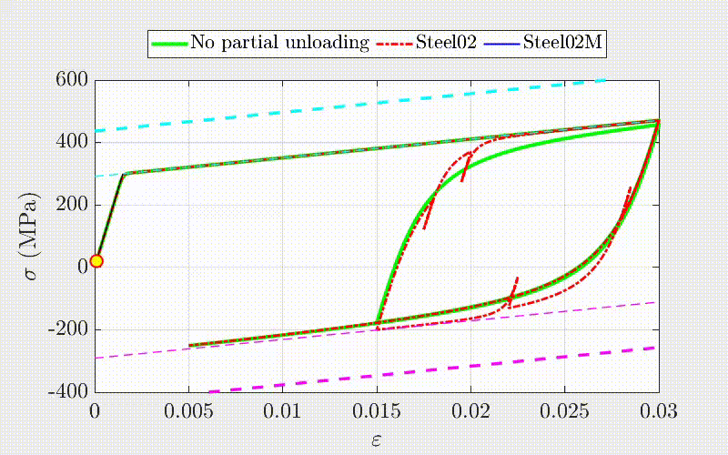

.. _steel02m:

Steel02M Material
^^^^^^^^^^^^^^^^^

This command is used to construct the Steel02M uniaxial steel material, a modified Giuffre-Menegotto-Pinto model developed to eliminate overshooting and  creeping errors observed in Steel02. It also permits independent definition of key cyclic material parameters in the positive and negative loading directions.

.. function:: uniaxialMaterial Steel02M $matTag $E $FyPos $FyNeg $alphaPos $alphaNeg $R0 $cR1 $cR2 <$a_pos $a_neg> <$etaPos $etaNeg> <$b_pos $b_neg>
.. csv-table::
   :header: "Argument", "Type", "Description"
   :widths: 10, 10, 40

   $matTag, |integer|, integer tag identifying material
   $E, |float|, elastic Young's modulus
   $FyPos, |float|, initial yield strength in the positive loading direction :math:`(\sigma_{y0}^{+})`
   $FyNeg, |float|, initial yield strength in the negative loading direction :math:`(\sigma_{y0}^{-})`; must be negative
   $alphaPos, |float|, strain-hardening ratio in the positive loading direction :math:`(\alpha^{+})`
   $alphaNeg, |float|, strain-hardening ratio in the negative loading direction :math:`(\alpha^{-})`
   $R0 $cR1 $cR2, 3 |float|, parameters to control the transition from elastic to plastic branches
   $a_pos, |float|, cyclic isotropic hardening parameter in the positive loading direction (optional: default = 0.0).
   $a_neg, |float|, cyclic isotropic hardening parameter in the negative loading direction (optional: default = 0.0).
   $etaPos, |float|, saturation-to-initial-yield-strength ratio in the positive loading direction :math:`(\eta^{+})` (optional: default = 1.5).
   $etaNeg, |float|, saturation-to-initial-yield-strength ratio in the negative loading direction :math:`(\eta^{-})` (optional: default = 1.5).
   $b_pos, |float|, isotropic hardening rate parameter in the positive loading direction :math:`(b^{+})` (optional: default = 0.8). 
   $b_neg, |float|, isotropic hardening rate parameter in the negative loading direction :math:`(b^{-})` (optional: default = 0.8).

.. note::

   Recommended values: $R0=between 10 and 20, $cR1=0.925, $cR2=0.15

.. _fig-steel02m:

	Comparison of stress-strain response using Steel02 and Steel02M

.. figure:: figures/Steel02M/Steel02MParametric.jpeg
	:align: center
	:figclass: align-center

	llustration of the additional features incorporated in the Steel02M material model, showing independent definitions in the positive and negative directions of: (a) strain hardening ratios, (b) initial yield strengths, (c) isotropic hardening rates, and (d) saturation-to-initial yield strength ratios

.. admonition:: Example
 
   The following example constructs a ``Steel02M`` material using all material parameters. For additional examples and implementation details, see `Steel02M GitHub repository <https://github.com/Kolay-IITK/Steel02M>`_.

   .. code-block:: tcl

      set matTag    1
      set E         200000.0
      set FyPos     300.0
      set FyNeg     -300
      set alphaPos  0.0196
      set alphaNeg  0.0196
      set R0        20.0
      set cR1       0.916
      set cR2       0.15
      set a_pos     0.05
      set a_neg     0.074
      set etaPos    1.50
      set etaNeg    1.50
      set b_pos     0.80
      set b_neg     0.80

      uniaxialMaterial Steel02M $matTag $E $FyPos $FyNeg $alphaPos $alphaNeg $R0 $cR1 $cR2 $a_pos $a_neg $etaPos $etaNeg $b_pos $b_neg

References
==========

Kolay, C., Karmakar, S., Kumar, B., and Kakoty, H. (2026). *An Improved Giuffré–Menegotto–Pinto Model: Implementation in OpenSees and Verification With Experimental Results.* Earthquake Engineering & Structural Dynamics. DOI: https://doi.org/10.1002/eqe.70266

Code inquiry or bug reporting 
==========

- Chinmoy Kolay, Indian Institute of Technology kanpur, e-mail: ckolay@iitk.ac.in
- Sukanya Karmakar, Indian Institute of Technology kanpur, e-mail: sukanyak@iitk.ac.in
- Baban Kumar, Indian Institute of Technology kanpur, e-mail: babank@iitk.ac.in
- Hironmoy kakoty, Indian Institute of Technology kanpur, e-mail: kakoty@iitk.ac.in
